# Stock Market Analysis

Using pandas to get stock information, visualize different aspects of it, and analyze the risk of a stock from previous performance history. Will be using Bootstrap and Monte Carlo Method to predict VaR and stocks

Info that would be visualized 

1. Change in price over time
2. Daily return of the stock market average
3. Moving average of the various stocks
4. Correlation between different stocks' closing price
5. Correlation between different stocks' daily returns
6. Value that should be put at risk when investing a certain stock
7. How to predict future stock behaviour 


```python
import pandas as pd
from pandas import Series, DataFrame
import numpy as np

#Visualization
import matplotlib.pyplot as plt
import seaborn as sns
sns.set_style('whitegrid')
%matplotlib inline

#For reading stock data 

from pandas_datareader import data, wb
import pandas_datareader as pdr
#For time stamps 
from datetime import datetime 
#Division
from __future__ import division 
```


```python
#Using Yahoo to grab stock information

tech_stock = ['GOOG','MSFT','AMZN','AAPL']
```


```python
end = datetime.now()
#Setting start and end date (a year ago now)
start = datetime(end.year - 1, end.month, end.day)
```


```python
#Setting up Yahoo's financial data as a dataframe 

for stock in tech_stock:
    globals()[stock] = pdr.get_data_yahoo(stock, start,end)
```


```python
AAPL.describe() #Statistics on Apple stocks 
```


<div>
<style>
    .dataframe thead tr:only-child th {
        text-align: right;
    }

    .dataframe thead th {
        text-align: left;
    }

    .dataframe tbody tr th {
        vertical-align: top;
    }
</style>
<table border="1" class="dataframe">
  <thead>
    <tr style="text-align: right;">
      <th></th>
      <th>Open</th>
      <th>High</th>
      <th>Low</th>
      <th>Close</th>
      <th>Adj Close</th>
      <th>Volume</th>
    </tr>
  </thead>
  <tbody>
    <tr>
      <th>count</th>
      <td>253.000000</td>
      <td>253.000000</td>
      <td>253.000000</td>
      <td>253.000000</td>
      <td>253.000000</td>
      <td>2.530000e+02</td>
    </tr>
    <tr>
      <th>mean</th>
      <td>141.592688</td>
      <td>142.554546</td>
      <td>140.690672</td>
      <td>141.735415</td>
      <td>140.945597</td>
      <td>2.795196e+07</td>
    </tr>
    <tr>
      <th>std</th>
      <td>17.070461</td>
      <td>17.105633</td>
      <td>16.825775</td>
      <td>16.926442</td>
      <td>17.395161</td>
      <td>1.187091e+07</td>
    </tr>
    <tr>
      <th>min</th>
      <td>106.570000</td>
      <td>107.680000</td>
      <td>104.080002</td>
      <td>105.709999</td>
      <td>104.410980</td>
      <td>1.147590e+07</td>
    </tr>
    <tr>
      <th>25%</th>
      <td>131.350006</td>
      <td>132.220001</td>
      <td>131.119995</td>
      <td>132.039993</td>
      <td>130.417435</td>
      <td>2.078820e+07</td>
    </tr>
    <tr>
      <th>50%</th>
      <td>144.470001</td>
      <td>145.460007</td>
      <td>143.500000</td>
      <td>144.529999</td>
      <td>143.616013</td>
      <td>2.533170e+07</td>
    </tr>
    <tr>
      <th>75%</th>
      <td>154.970001</td>
      <td>155.539993</td>
      <td>153.910004</td>
      <td>155.300003</td>
      <td>154.762253</td>
      <td>3.226450e+07</td>
    </tr>
    <tr>
      <th>max</th>
      <td>174.000000</td>
      <td>175.250000</td>
      <td>173.600006</td>
      <td>174.809998</td>
      <td>174.809998</td>
      <td>1.119850e+08</td>
    </tr>
  </tbody>
</table>
</div>


```python
AAPL.info()
```

    <class 'pandas.core.frame.DataFrame'>
    DatetimeIndex: 253 entries, 2016-11-07 to 2017-11-07
    Data columns (total 6 columns):
    Open         253 non-null float64
    High         253 non-null float64
    Low          253 non-null float64
    Close        253 non-null float64
    Adj Close    253 non-null float64
    Volume       253 non-null int64
    dtypes: float64(5), int64(1)
    memory usage: 13.8 KB


```python
#Historical view on closing price
AAPL['Adj Close'].plot(legend=True, figsize=(10,4))
```


    <matplotlib.axes._subplots.AxesSubplot at 0x1a0de8b250>


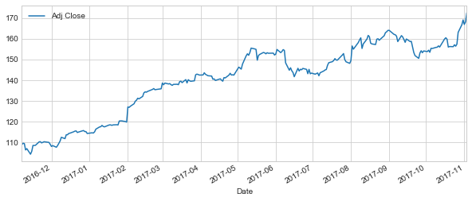


```python
#Total volume of stock being traded each day over the course of 5 years
AAPL['Volume'].plot(legend=True,figsize=(12,4))
```


    <matplotlib.axes._subplots.AxesSubplot at 0x1a10af4090>


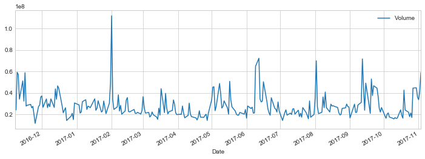


```python
#Calculating three moving averages 
#MA = Moving Average
ma_day = [5,10,15,20]

for ma in ma_day:
    column_name = "MA for %s days" %(str(ma))
    AAPL[column_name] = Series.rolling(AAPL['Adj Close'],ma).mean()

```


```python
AAPL[['Adj Close','MA for 5 days','MA for 10 days','MA for 15 days','MA for 20 days']].plot(subplots=False,figsize=(10,4))
```


    <matplotlib.axes._subplots.AxesSubplot at 0x1a119b6710>


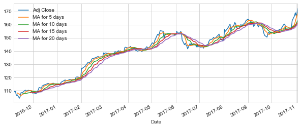


## Daily Return Analysis

- Daily Changes of stocks


```python
#Percent Change for each day 

AAPL['Daily Return'] = AAPL['Adj Close'].pct_change()
AAPL['Daily Return'].plot(figsize=(16,4),legend=True,linestyle='--',marker='o')
```


    <matplotlib.axes._subplots.AxesSubplot at 0x1a16021d50>


```python
#Seaborn does not recongize null values so I have to use dropna()
sns.distplot(AAPL['Daily Return'].dropna(),bins=100,color='purple')
```


    <matplotlib.axes._subplots.AxesSubplot at 0x1a16243990>


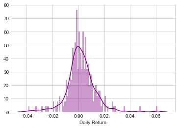


```python
#Using a histogram plot
AAPL['Daily Return'].hist()
```


    <matplotlib.axes._subplots.AxesSubplot at 0x1a164b3e50>


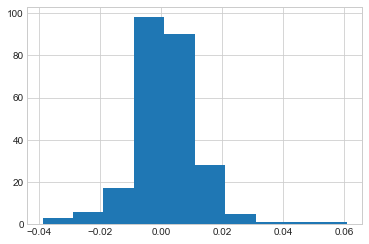


```python
# Grab all the closing prices for the tech stock list into one DataFrame
closingPrice_dataFrame = pdr.get_data_yahoo(['AAPL','MSFT','AMZN','GOOG'],start,end)['Adj Close']
```


```python
closingPrice_dataFrame.head()
```


<div>
<style>
    .dataframe thead tr:only-child th {
        text-align: right;
    }

    .dataframe thead th {
        text-align: left;
    }

    .dataframe tbody tr th {
        vertical-align: top;
    }
</style>
<table border="1" class="dataframe">
  <thead>
    <tr style="text-align: right;">
      <th></th>
      <th>AAPL</th>
      <th>AMZN</th>
      <th>GOOG</th>
      <th>MSFT</th>
    </tr>
    <tr>
      <th>Date</th>
      <th></th>
      <th></th>
      <th></th>
      <th></th>
    </tr>
  </thead>
  <tbody>
    <tr>
      <th>2017-11-07</th>
      <td>174.809998</td>
      <td>1123.170044</td>
      <td>1033.329956</td>
      <td>84.269997</td>
    </tr>
    <tr>
      <th>2017-11-06</th>
      <td>174.250000</td>
      <td>1120.660034</td>
      <td>1025.900024</td>
      <td>84.470001</td>
    </tr>
    <tr>
      <th>2017-11-03</th>
      <td>172.500000</td>
      <td>1111.599976</td>
      <td>1032.479980</td>
      <td>84.139999</td>
    </tr>
    <tr>
      <th>2017-11-02</th>
      <td>168.110001</td>
      <td>1094.219971</td>
      <td>1025.579956</td>
      <td>84.050003</td>
    </tr>
    <tr>
      <th>2017-11-01</th>
      <td>166.889999</td>
      <td>1103.680054</td>
      <td>1025.500000</td>
      <td>83.180000</td>
    </tr>
  </tbody>
</table>
</div>


```python
techReturns_dataFrame = closingPrice_dataFrame.pct_change()
```


```python
#Comparing Google to Google
sns.jointplot('GOOG','GOOG',techReturns_dataFrame,kind='scatter',color='cyan')
```


    <seaborn.axisgrid.JointGrid at 0x1a169c8b90>


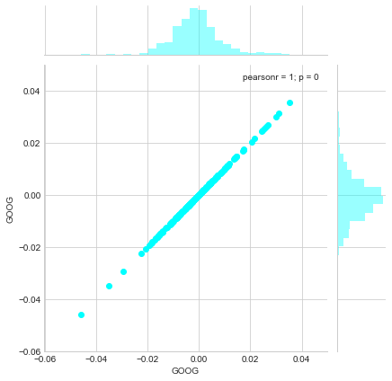


```python
#Dealing with correlations now 
#Comparing Google with microsoft and seeing if there's any correlation 
sns.jointplot('GOOG','MSFT',techReturns_dataFrame,kind='scatter')
```


    <seaborn.axisgrid.JointGrid at 0x1a12c35f90>


From what is presented above, there seem to be some sort of correlation forming


```python
#A sense of what's correlated and what is not
from IPython.display import SVG
SVG(url='http://upload.wikimedia.org/wikipedia/commons/d/d4/Correlation_examples2.svg')
```


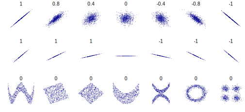


```python
#To see the correlation for all the companies all at once
sns.pairplot(techReturns_dataFrame.dropna())
```


    <seaborn.axisgrid.PairGrid at 0x1a13cfb150>


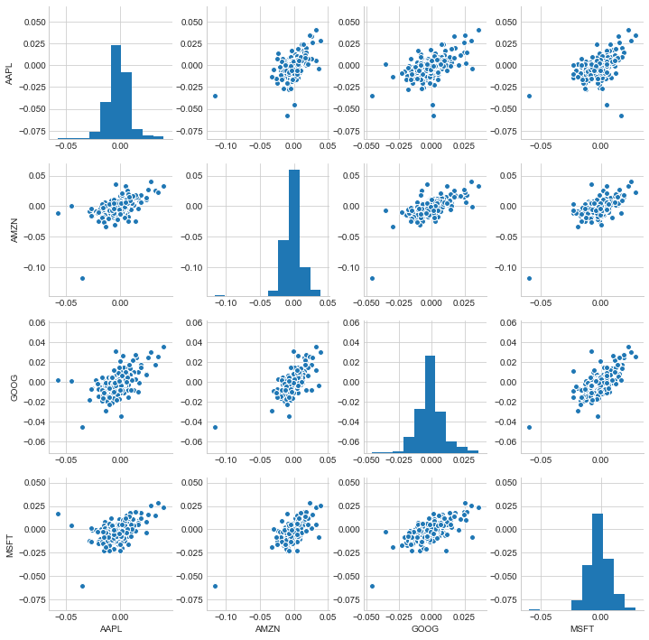


### Above are all the daily returns between on stocks (correlation) 


```python
#Full control of the figure, including the upper triangle, and the lower triangle
fig = sns.PairGrid(techReturns_dataFrame.dropna())

fig.map_upper(plt.scatter,color='red')
fig.map_lower(sns.kdeplot,cmap='cool_d')
fig.map_diag(plt.hist,bins=20)
```


    <seaborn.axisgrid.PairGrid at 0x1a13d13890>


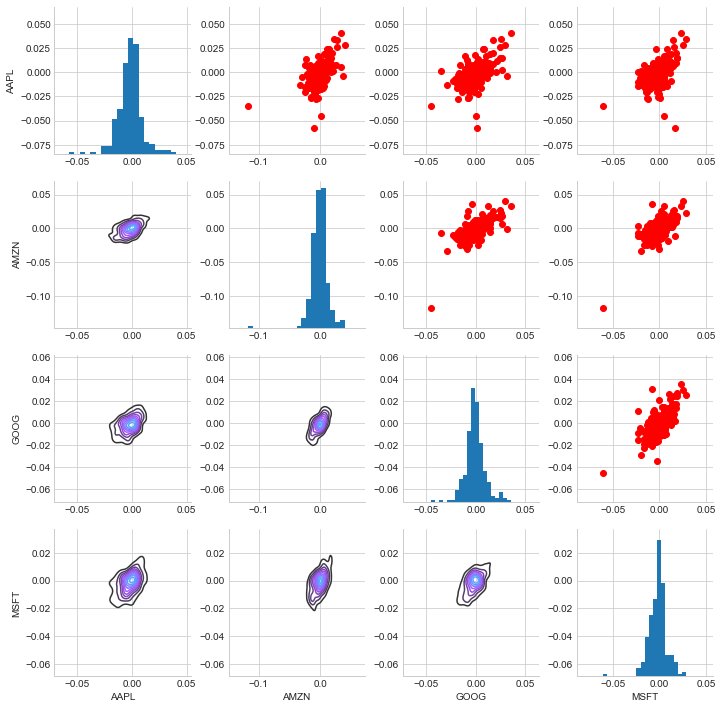


```python
#Correlation of closing price
fig = sns.PairGrid(closingPrice_dataFrame.dropna())

fig.map_upper(plt.scatter,color='red')
fig.map_lower(sns.kdeplot,cmap='cool_d')
fig.map_diag(plt.hist,bins=20)
```


    <seaborn.axisgrid.PairGrid at 0x1a13bb1610>


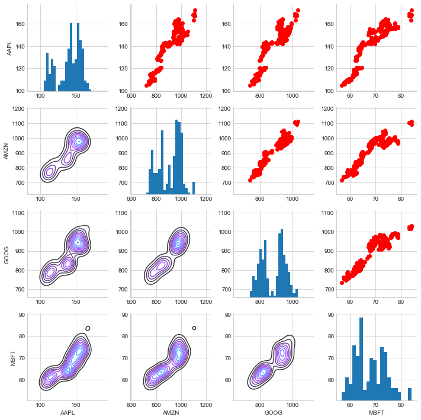


## Risk Analysis 

- Gathering daily percentage returns by comparing the expected return with the standard deviation of the daily returns


```python
returns = techReturns_dataFrame.dropna()
```


```python
plt.scatter(returns.mean(), returns.std(), alpha=0.5,s = np.pi*20)
#Setting limits
plt.ylim([0.005,0.025])
plt.xlim([-0.003,0.002])

#Set the plot axis titles
plt.xlabel('Expected Returns')
plt.ylabel('Risk')

#Labelling the scatterplots:  http://matplotlib.org/users/annotations_guide.html
for label, x, y in zip(returns.columns, returns.mean(), returns.std()):
    plt.annotate(
        label, 
        xy = (x, y), xytext = (50, 50),
        textcoords = 'offset points', ha = 'right', va = 'bottom',
        arrowprops = dict(arrowstyle = '-', connectionstyle = 'arc3,rad=-0.3'))
```


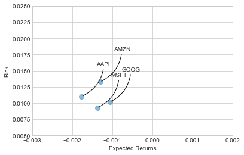


## Value at Risk 

#### Using bootstrap method 

Calculate the empirical quantiles from a histogram of daily returns. 
Quantiles information http://en.wikipedia.org/wiki/Quantile


```python
#Repeating the daily returns for histogram for Apple Stock
#.displot = distribution plot 
sns.distplot(AAPL['Daily Return'].dropna(),bins=100,color='purple')
```


    <matplotlib.axes._subplots.AxesSubplot at 0x1a16bb95d0>


```python
#0.05 empirical quantiles of daily returns 
returns['AAPL'].quantile(0.05)
```


    -0.01729882171950793


This is very interesting to see. 
With 0.05 empirical quantiles, the daily returns is -0.017. 
The definition of this is that with 95% confidence, the worst daily loss will not surpass 1.7%. 
If I had \$10 000, my one day VaR (Value at Risk) would be $170

## Value at Risk using the Monte Carlo Method 

Brief Overview: Using the Monte Carlo Method to run many trials with random market conditions and therefore calculate losses/gains for each trial. Then using aggregation to from the trials to establish the risk of a certain stock. 

The Stock Market will follow a random walk (Markov process) and is following the weak form of EMH (Efficient Market Hypothesis)
The weak form of EMH states that the next price movement is conditionally dependent on past price movements given that the past prices have been incorporated. 

This means that the exact price cannot be predicted perfectly solely based on past stocks information

EMH: https://en.wikipedia.org/wiki/Efficient-market_hypothesis

Makov Process: https://en.wikipedia.org/wiki/Markov_chain 
(A stochastic process that satisfies the Markov property if one can make predictions for the future of the process based solely on its present state just as well as one could knowing the process's full history)


Geometric Browninan Motion equation: (Markov Process)
### ΔS/S = μΔt+σϵ√Δt
In this equation s = stock price, μ = expected return, σ = standard deviation of returns, t = time, ϵ = random variable

Therefore multiplying the stock price by both sides, the equation is equal to:

### ΔS=S(μΔt+σϵ√Δt)

μΔt is known as the "drift" where average daily returns are multiplied by the change in time. σϵ√Δt is known as the "shock" and the shock is where it'll push the stocks either up or down. By doing drift and shock thousand of times, a simulation can occur to where a stock price might be. 
Techniques were summarized from here: http://www.investopedia.com/articles/07/montecarlo.asp


```python
#Setting up the year: 
days = 365

#Setting dt
dt = 1/365

#Finding the dift of Google's dataframe 
mu = returns.mean()['GOOG']

#Calculating the volatility 
sigma = returns.std()['GOOG']
```


```python
'''
The following function takes in starting stock prices, 
days of simulations, mu, and sigma. 
It returns a simulated price array 
'''

def stock_monte_carlo(start_price, days, mu, sigma):
    
    price = np.zeros(days)
    price[0] = start_price
    shock = np.zeros(days)
    drift = np.zeros(days)
    
    for x in xrange(1,365):
        #calculating the shock (σϵ√Δt )
        shock[x] = np.random.normal(loc=mu*dt,scale = sigma*np.sqrt(dt))
        #calculate Drift
        drift[x] = mu * dt 
        #calculate Price
        price[x] = price[x-1] + (price[x-1] * (drift[x] + shock[x]))
        
    return price 
```


```python
GOOG.head()
```


<div>
<style>
    .dataframe thead tr:only-child th {
        text-align: right;
    }

    .dataframe thead th {
        text-align: left;
    }

    .dataframe tbody tr th {
        vertical-align: top;
    }
</style>
<table border="1" class="dataframe">
  <thead>
    <tr style="text-align: right;">
      <th></th>
      <th>Open</th>
      <th>High</th>
      <th>Low</th>
      <th>Close</th>
      <th>Adj Close</th>
      <th>Volume</th>
    </tr>
    <tr>
      <th>Date</th>
      <th></th>
      <th></th>
      <th></th>
      <th></th>
      <th></th>
      <th></th>
    </tr>
  </thead>
  <tbody>
    <tr>
      <th>2016-11-07</th>
      <td>774.500000</td>
      <td>785.190002</td>
      <td>772.549988</td>
      <td>782.520020</td>
      <td>782.520020</td>
      <td>1585100</td>
    </tr>
    <tr>
      <th>2016-11-08</th>
      <td>783.400024</td>
      <td>795.632996</td>
      <td>780.190002</td>
      <td>790.510010</td>
      <td>790.510010</td>
      <td>1350800</td>
    </tr>
    <tr>
      <th>2016-11-09</th>
      <td>779.940002</td>
      <td>791.226990</td>
      <td>771.669983</td>
      <td>785.309998</td>
      <td>785.309998</td>
      <td>2607100</td>
    </tr>
    <tr>
      <th>2016-11-10</th>
      <td>791.169983</td>
      <td>791.169983</td>
      <td>752.179993</td>
      <td>762.559998</td>
      <td>762.559998</td>
      <td>4745200</td>
    </tr>
    <tr>
      <th>2016-11-11</th>
      <td>756.539978</td>
      <td>760.780029</td>
      <td>750.380005</td>
      <td>754.020020</td>
      <td>754.020020</td>
      <td>2431800</td>
    </tr>
  </tbody>
</table>
</div>


```python
#Starting price
start_price = 774.50

for i in xrange(365):
    plt.plot(stock_monte_carlo(start_price, days, mu, sigma))

plt.xlabel("Days")
plt.ylabel("Price")
plt.title("Monte Carlo Analysis for Google")
```


    Text(0.5,1,u'Monte Carlo Analysis for Google')


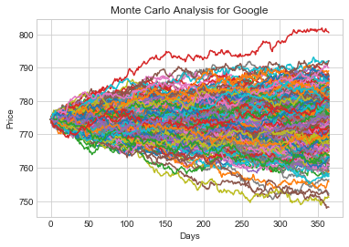


```python
#Going to plot the above on a histogram for better visualization 

#Going to run this simulation 10000 times now
runs = 10000
simulations = np.zeros(runs)
np.set_printoptions(threshold = 4) #Or else the output would be far too long to read
for i in xrange(runs):
    #returning [days-1] because we're extracting the end date
    simulations[i] = stock_monte_carlo(start_price, days, mu, sigma)[days-1]; 
```


```python
# q as the 1% empirical qunatile therefore 99% of the values should fall between here
q = np.percentile(simulations, 1)
    
# Plotting the distribution of the end prices
plt.hist(simulations,bins=200)

# Using plt.figtext to fill in some additional information onto the plot

# Starting Price
plt.figtext(0.6, 0.8, s="Start price: $%.2f" %start_price)
# Mean ending price
plt.figtext(0.6, 0.7, "Mean final price: $%.2f" % simulations.mean())

# Variance of the price (within 99% confidence interval)
plt.figtext(0.7, 0.6, "VaR(0.99): $%.2f" % (start_price - q,))

# Display 1% quantile
plt.figtext(0.15, 0.6, "q(0.99): $%.2f" % q)

# Plot a line at the 1% quantile result
plt.axvline(x=q, linewidth=4, color='r')

# Title
plt.title("Final price distribution for Google Stock after %s days" % days, weight='bold');
```


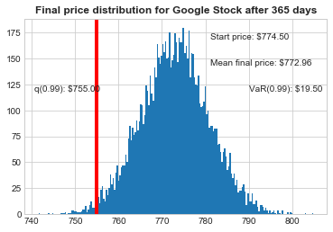


From above, the Value at Risk seems to be \$19.50 for every \$774.50 invested. <br> If a user was putting \$774.50 as an initial investment, it means he's putting \$19.50 at risk. 
